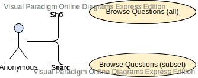
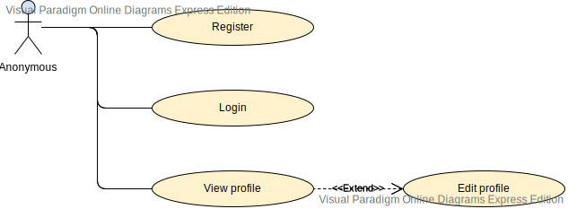
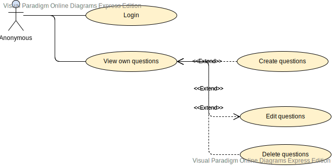
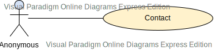
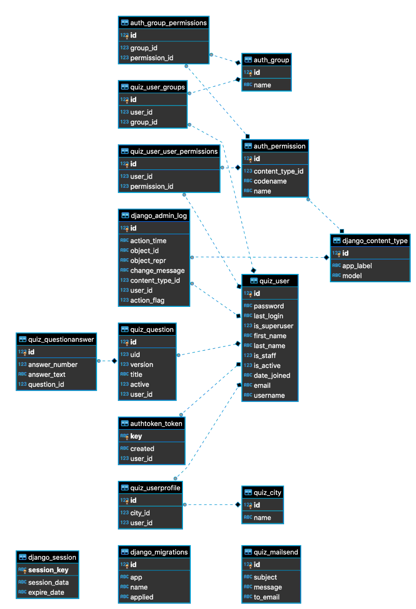

# Analytics

## Link for repository
https://github.com/simmarum/quizlytics

## Installation

#### Backend
```
bash backend/create_v-env.sh
touch backend/analytics/analytics/cred.py
```
Paste into `backend/analytics/analytics/cred.py`
```
def get_email_cred():
    return {
        "EMAIL_HOST_PASSWORD": "password",
        "EMAIL_HOST_USER": "your_mail"
    }
```
```
. ./backend/v-env/bin/activate
python ./backend/analytics/manage.py migrate
bash backend/run_dev.sh
```
#### Frontend
```
bash frontend/create_v-env.sh
bash frontend/run_dev.sh
```
#### Remember
After installation some feature of site may not work because you have empty database and someone must populate it using console or django admin site. Search on the Internet for creating superuser in django from consol and access to admin page. Then populate database with some *cities*.

## Structure
This app is like blog. You can create questions with answers (at least one) and save it to your account.

Everyone can list and search all questions.

As owner of question you can edit it (save as new version), display historical versions and delete whole question.

As administrator you can log to admin django panel and have more privileges to maintenance data in database.

Everyone can contact me by contact form in proper tab.

## Roles
- **Anonymous** - list questions, send mail, register, login
- **Logged** - *Anonymous* + create questions with answer (edit and delete)
- **Admin** - *Logged* + access to `django admin`

## Modules
- **User**
    - **Login/Register** - allows to register new users and to log for existsing
    - **Auth** - maintenance *token* (obtain, using and refresh)
- **Questions**
    - **Show questions** - list all question and allows to search by *title*
    - **Manage questions** - allows to edit questions, show historical version and delete own questions
- **Contact** - simple form to send mail to owner of site

## Technology stack
#### Backend
- Python 3.7.4
- Django 2.2.7

#### Frontend
- Python 3.7.4
- Node 13.3.0
- Next 9.1.4
- React 16.12.0

## Test
#### Backend
```
(v-env) (base) ➜  analytics git:(master) ✗ python manage.py test
Creating test database for alias 'default'...
System check identified no issues (0 silenced).
....................
----------------------------------------------------------------------
Ran 20 tests in 2.958s

OK
Destroying test database for alias 'default'...
```

## Instruction for users
### Anonymous
Just open main site and you can search whatever question with answer you want.
If you want create questions please *register* yourself and go to next point.

You can also send mail to owner of page under *contact* page. There is form with *subject*, *message* and place where you can pass *your email*. It is necessary to response to you.
### Logged
When you are *logged in* you can go to *my_questions* tab and there you can:
- *create* new one
    - fill *title*
    - add *answer* and fill it value
    - remove *answer* if you decide that this answer is "useless"
- *edit* existing one
    - here you can see similar form what for *create*
    - under this form are historical version of this questions with answers
    - Every edition **create new version**
- *delete* just delete this question with answers

### Admin
This is *special user* on site with almost all privileges.
If you want to be *admin* you must be added to this group by *another admin*.
Here you have access to special `django admin` on special website, where you can manipulate data with database. **You should use it wisely, because here you can break the whole system/site**

## Use case diagrams
All diagrams were created using https://online.visual-paradigm.com/ site.

#### Browse question and search


#### Register, login and manage profile


#### Login, create/edit/delete questions


#### Send mail to owner of site


## Database diagram
Diagram was created using `DBeaver` https://dbeaver.io


#### Important relation
- **quiz_user**
    - id - unique id of user in system
    - is_staff - use for higher priority (django admin page)
    - email - use as username
- **quiz_profile** (extend of standard django users table, one user can have only one city)
    - id - unique id of profile in system
    - user_id - indicate user
    - city_id - indicate city
- **quiz_city**
    - id - unique id of city in system
    - name - name of city (must be unique)
- **quiz_question**
    - id - unique id of question in system
    - uid - id for one question (with different versions)
    - version - version of this question
    - title - title
    - active - if 0 (zero) then question is deleted (soft)
- **quiz_questionanswer** (multiple answers for one question)
    - id - unique id of answer in system
    - question_id - key to match all answer to proper question (in given version so key is for id not uid)
    - answer_number - this indicate order on site
    - answer_text - text of answers
- **quiz_mailsend**
    - id - unique id of mailsend in system
    - subject - subject of email
    - message - content of email
    - to_email - mail to which to send a reply
- **auth_\***,**django_\***,**authtoken_token** - tables created by used packages
